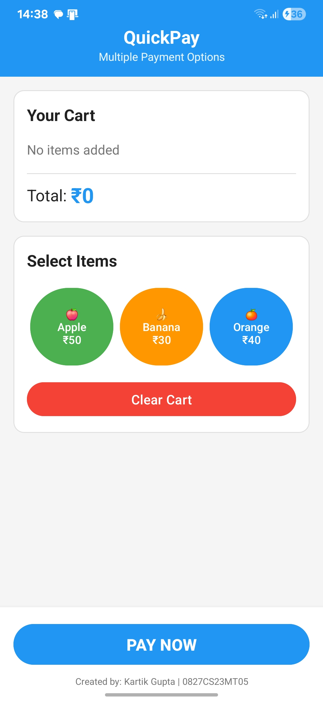
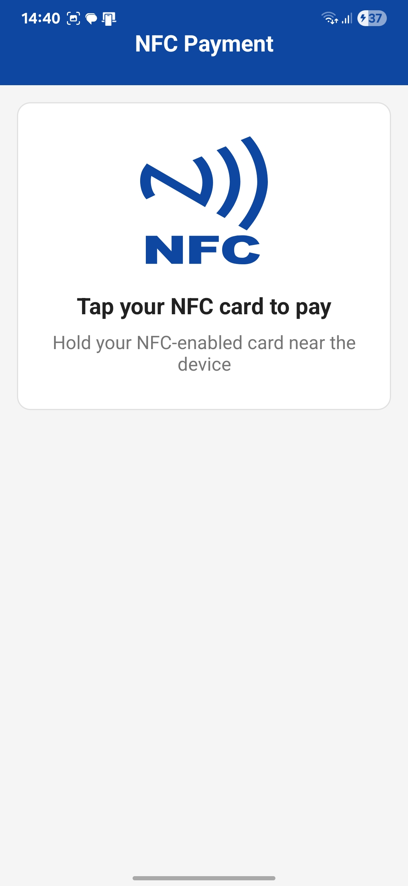

# NFC Pay Demo 📱💳

A comprehensive Android application demonstrating Near Field Communication (NFC) technology for secure mobile payments. This app showcases multiple payment methods including NFC, UPI, and Card payments with enhanced security features and user experience optimizations.

## 🚀 Features

### Payment Methods
- **NFC Payment**: Tap-to-pay functionality with NFC-enabled cards
- **UPI Payment**: Integration with UPI payment system
- **Card Payment**: Credit/Debit card processing with OTP verification

### Security & Validation
- **PIN Authentication**: 4-digit PIN (2580) for NFC payments
- **Transaction Limits**: ₹10,000 maximum transaction limit
- **Session Timeout**: 5-minute security timeout
- **Real-time Validation**: Instant field validation with visual feedback
- **Card Type Detection**: Automatic detection of Visa, Mastercard, and RuPay

### User Experience Enhancements
- **Haptic Feedback**: Tactile responses for all interactions
- **Sound Effects**: Audio feedback for different actions
- **Auto-Focus**: Smart field navigation and keyboard management
- **Swipe Gestures**: Navigate with intuitive swipe controls
  - Swipe Right: Quick payment
  - Swipe Left: Clear cart
  - Swipe Up/Down: Show gesture hints

### Shopping Cart
- Add fruits (Apple ₹50, Banana ₹30, Orange ₹40)
- Real-time total calculation
- Cart management with clear functionality

## 📱 Screenshots

### Main App Flow
<div align="center">
  
  
  
</div>

### NFC Payment Flow
<div align="center">
  
  
  
</div>

<div align="center">
  
  
</div>

### UPI Payment Flow
<div align="center">
  
  
  
</div>

### Card Payment Flow
<div align="center">
  
  
  
</div>

<div align="center">
  
</div>

## 🛠️ Technical Stack

- **Language**: Kotlin
- **Platform**: Android (API 21+)
- **Architecture**: Activity-based with modern Android practices
- **NFC**: Android NFC API integration
- **UI**: Material Design components
- **Validation**: Real-time form validation
- **Security**: PIN-based authentication, session management

## 📋 Prerequisites

- Android Studio Arctic Fox or later
- Android device with NFC capability
- Minimum SDK: API 21 (Android 5.0)
- Target SDK: API 33 (Android 13)

## 🔧 Installation

1. **Clone the repository**
   ```bash
   git clone https://github.com/kg-0805/NFC-Application.git
   cd NFC-Application
   ```

2. **Open in Android Studio**
   - Launch Android Studio
   - Select "Open an existing project"
   - Navigate to the cloned directory

3. **Build and Run**
   - Connect your Android device or start an emulator
   - Click "Run" or press Shift+F10

## 📖 Usage

### Shopping
1. Add items to cart by tapping fruit buttons
2. View real-time total calculation
3. Clear cart using swipe left or clear button

### NFC Payment
1. Tap "PAY NOW" or swipe right
2. Select "NFC Payment"
3. Tap NFC card when prompted
4. Enter PIN: **2580**
5. Payment processing and confirmation

### Card Payment
1. Select "Card Payment"
2. Enter card details with real-time validation
3. Enter OTP: **111111** or **222222**
4. Payment confirmation

### UPI Payment
1. Select "UPI Payment"
2. Choose UPI app (simulated)
3. Approve payment in UPI app
4. Return to app for confirmation

## 🔐 Security Features

- **PIN Protection**: NFC payments require 4-digit PIN
- **Session Management**: Auto-logout after 5 minutes
- **Transaction Limits**: Built-in spending limits
- **Input Validation**: Real-time form validation
- **Error Handling**: Comprehensive error management

## 🎨 User Experience

- **Haptic Feedback**: Vibration on all interactions
- **Sound Effects**: Audio cues for actions
- **Auto-Focus**: Smart field navigation
- **Gesture Controls**: Swipe-based navigation
- **Visual Feedback**: Immediate validation indicators

## 🧪 Testing

### Test Credentials
- **NFC PIN**: 2580
- **Card OTP**: 111111 or 222222
- **Valid Card Numbers**: Start with 4 (Visa), 5 (Mastercard), 60/65/81/82 (RuPay)

### NFC Testing
1. Use NFC tags with "PAY" message
2. Or simulate NFC tap in app
3. Test with different card types

## 📁 Project Structure

```
app/
├── src/main/
│   ├── java/com/example/nfcpaydemo/
│   │   ├── MainActivity.kt              # Main shopping interface
│   │   ├── PaymentOptionsActivity.kt    # Payment method selection
│   │   ├── NFCPaymentActivity.kt        # NFC payment processing
│   │   ├── CardPaymentActivity.kt       # Card payment form
│   │   └── UPIPaymentActivity.kt        # UPI payment simulation
│   ├── res/
│   │   ├── layout/                      # UI layouts
│   │   ├── drawable/                    # Icons and graphics
│   │   ├── values/                      # Colors, strings, styles
│   │   └── xml/                         # NFC tech filters
│   └── AndroidManifest.xml              # App configuration
```

## 🔄 Payment Flow

1. **Shopping** → Add items to cart
2. **Payment Selection** → Choose payment method
3. **Authentication** → PIN/OTP verification
4. **Processing** → Secure payment processing
5. **Confirmation** → Success/failure feedback

## 🛡️ Permissions

```xml
<uses-permission android:name="android.permission.NFC" />
<uses-permission android:name="android.permission.VIBRATE" />
<uses-feature android:name="android.hardware.nfc" android:required="false" />
```

## 🤝 Contributing

1. Fork the repository
2. Create a feature branch (`git checkout -b feature/AmazingFeature`)
3. Commit changes (`git commit -m 'Add AmazingFeature'`)
4. Push to branch (`git push origin feature/AmazingFeature`)
5. Open a Pull Request

## 📄 License

This project is licensed under the MIT License - see the [LICENSE](LICENSE) file for details.

## 👨💻 Author

**kartik Gupta**
- GitHub: [@/Kartik Gupta](https://github.com/kg-0805)
- LinkedIn: [Kartik Gupta](https://linkedin.com/in/kg-0805)

## 🙏 Acknowledgments

- Android NFC documentation
- Material Design guidelines
- UPI payment standards
- Security best practices for mobile payments

## 📞 Support

If you have any questions or issues, please open an issue on GitHub or contact the maintainer.

---

**Note**: This is a demonstration app for educational purposes. Do not use in production without proper security audits and compliance checks.